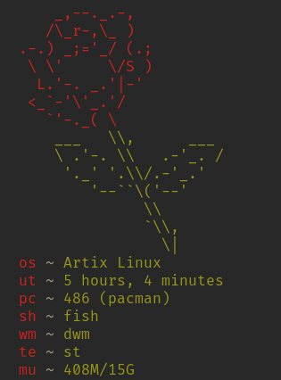

<h1 align="center">sfetch</h1>
sfetch is a shell script for displaying system information 
its also a simple replacement for neofetch, etc.
in less than 50 lines of code it can display ascii art and system information

## Installation
1. Clone the repository
  - `git clone https://github.com/ozpv/sfetch`
2. Change your working directory to sfetch
  - `cd sfetch`
3. Install using the Makefile included
  - `sudo make install` or `doas make install`

## Customization
sfetch by default can only be customized through the source code
